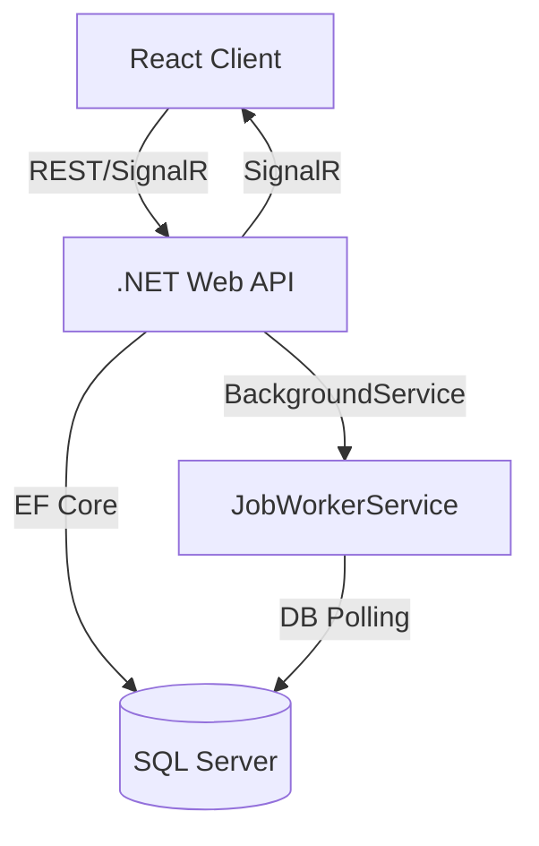

# System Architecture: Distributed Job Management System

## Overview
This system manages distributed background jobs, displays their statuses in real-time, and provides controls for job creation, management, and monitoring. It is designed for scalability, robustness, and maintainability.

---

## Architecture Diagram

---

## Key Components

### 1. **React Client**
- Displays job dashboard, creation form, and actions.
- Connects to the backend via REST API and SignalR for real-time updates.

### 2. **.NET Web API**
- Exposes endpoints for job CRUD and management.
- Hosts the SignalR hub for real-time communication.
- Handles job creation, stopping, restarting, and deletion.

### 3. **JobWorkerService (BackgroundService)**
- Runs as a hosted service in the backend.
- Polls the database for pending jobs, claims and processes them.
- Updates job progress, handles stop/restart, and marks jobs as completed or failed.
- Broadcasts job updates via SignalR.
- Supports multiple instances for horizontal scaling.

### 4. **SQL Server (Database)**
- Stores all job metadata and state.
- Acts as the distributed queue for jobs (no in-memory queue).
- Enables recovery and scaling by persisting all job information.

### 5. **SignalR**
- Provides real-time updates to all connected clients about job status and progress.

---

## Flow Summary
1. **User creates a job** via the React client.
2. **API** saves the job to the database with status `Pending`.
3. **JobWorkerService** (one or more instances) polls the DB, claims pending jobs, and processes them.
4. **Job progress and status** are updated in the DB and broadcast to clients via SignalR.
5. **Users can stop, restart, or delete jobs**; these actions are handled by the API and reflected in the DB and UI in real time.

---

## Scalability & Reliability
- Multiple worker services can run in parallel (across servers/containers), each picking up jobs from the shared DB.
- No job is processed twice due to atomic DB updates.
- All job state is persisted, so the system can recover from restarts or failures.

---

## Error Handling
- All job processing is wrapped in try/catch blocks.
- Errors are logged using .NET logging.
- Failed jobs are marked as such in the DB, with error details stored for debugging.

---

## Extensibility
- Add more job types, priorities, or worker logic as needed.
- Integrate with external message queues or cloud services for even greater scale. 